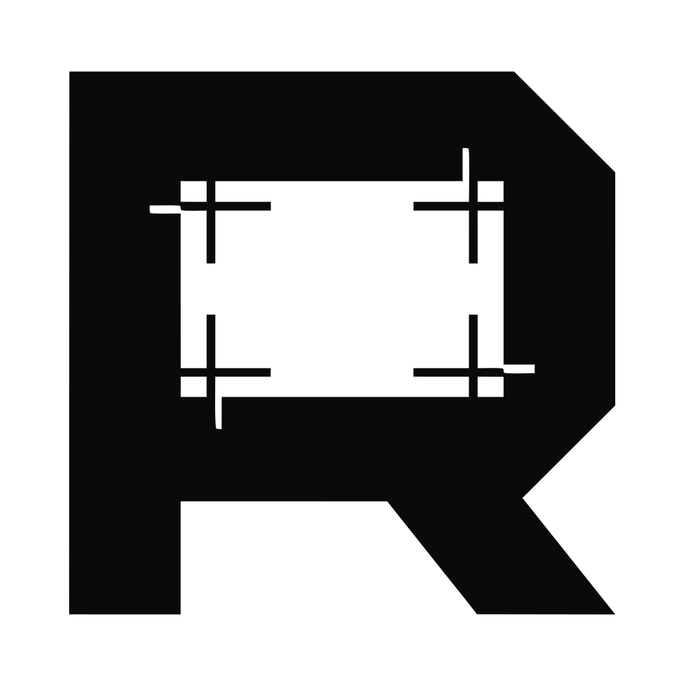

<div align="center">

<picture>
  <source media="(prefers-color-scheme: dark)" srcset=".github/assets/repoframe-logo-dark.svg">
  
</picture>

# Repo Frame

Turn any public GitHub repository into a polished social card.
Paste a repository URL, pick a template, tune the design, export an image.

**[repoframe.orbitslab.space](https://repoframe.orbitslab.space)**

[](https://repoframe.orbitslab.space)
[](LICENSE)
[](package.json)
[](https://repoframe.orbitslab.space/templates)

</div>

---

## Features

- 26 templates across three categories, in four aspect ratios
- PNG, WebP, and JPEG export at five pixel densities
- Per-template colour palettes, typography, spacing, and card controls
- Content-aware GitHub requests with a 30-minute local cache
- No account, backend, analytics, or uploaded design data

## Privacy

Repo Frame runs entirely in your browser. Repository data comes directly from
GitHub, and your designs, assets, and exported images are never uploaded to a
Repo Frame server. There is nothing to sign in to and nothing to delete.

## Quick start

Requires Node.js 22.12 or newer and pnpm 11.17.

```sh
pnpm install
pnpm dev
```

Open [http://localhost:3000](http://localhost:3000).

Paste a public repository such as `alfaarghya/alfa-leetcode-api`, choose a
template and ratio, then use Export to download the card. The editor restores
the active project from IndexedDB when storage is available.

Run the local quality gates before pushing:

```sh
pnpm check
pnpm typecheck
pnpm test
pnpm build
```

## Browser support

Repo Frame supports the latest two versions of Chrome, Edge, Firefox, and
Safari on desktop and mobile. PNG export is supported everywhere; WebP and JPEG
are hidden where the browser cannot produce them. Storage caching may be
unavailable in Firefox private browsing and some embedded webviews, and the app
continues without caching.

## Contributing

New templates are the main contribution path. Read
[CONTRIBUTING.md](CONTRIBUTING.md) for the template contract and the local
setup, and [ARCHITECTURE.md](ARCHITECTURE.md) for the boundaries the codebase
enforces.

- [Report a bug](https://github.com/orbitsLab/repoframe/issues/new?template=bug_report.md)
- [Request a template](https://github.com/orbitsLab/repoframe/issues/new?template=template_request.md)
- [Report a vulnerability](SECURITY.md)
- [Code of Conduct](CODE_OF_CONDUCT.md)
- [Changelog](CHANGELOG.md)

## License

Licensed under the [Apache License 2.0](LICENSE).

---

<div align="center">

<picture>
  <source media="(prefers-color-scheme: dark)" srcset=".github/assets/orbitslab-logo-dark.svg">
  
</picture>

Built by **[Orbits Lab](https://orbitslab.space)**

</div>
